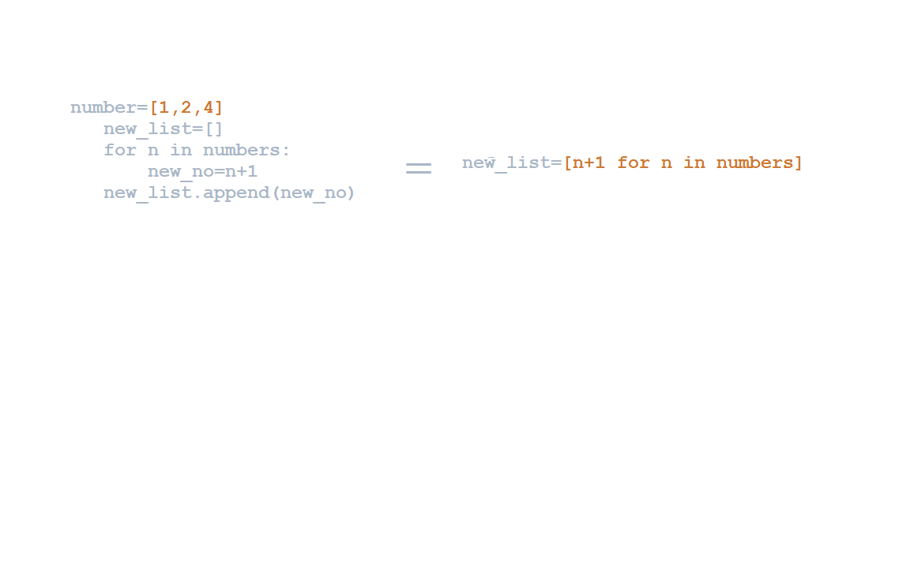

# india_state_guessing_game
This is game where you guess states and union territories of india .if you want to learn more name you write exit and app give you list of missing states using python turtle  and panda library

**Technologies**

**Python**

   Used libraries:
   
           Pandas: To work with data
           
           turtle:To construct the screen and handle it
  
**LIST COMPREHENSION**  
   List comprehension offers a shorter syntax when you want to create a new list based on the values of an existing list.
   
   
**FORK PROJECT** 
To run locally:

    1.Fork this repo.
    2.Run git clone [your-fork-url].
    3.Intially delete missing_states.csv file.
    4.After run the main.py the screen opens.
    5.fill as many states you know it fill the location on map.
    6.If you write exit it exit screen closed and Your missing.csv file is genrated with all the states which you missed.
  
